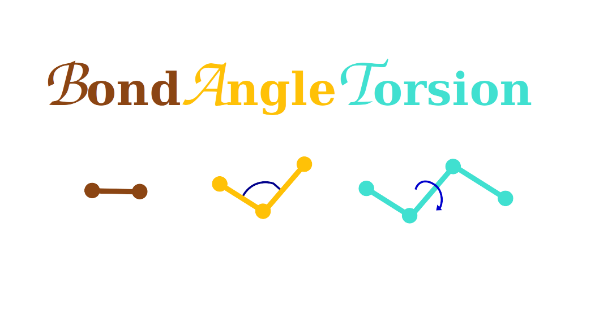

  

## BAT internal coordinate calculation libary compatible with pytorch. It offers:

1. Fully atomistic bond angle torsion (BAT) calculation for molecules (protein, ligand etc...)
   * Forward  XYZ --> BAT
   * Backward BAT --> XYZ
2. Peptide backbone (N,CA,C) based BAT calculation
3. Multilayer BAT
   * In this system can be devided into smaller fragmets, where reconstruction is
   independent.
   * Each fragment is attached to last root based atom via pseudobond
   * This is also convinient for multi chain complexes 
4. From sequence to BAT (in progress..)

  
  <imgcaption>BAT performance benchmark shown for five different protein trajectories
              with 10000 frames and varying size.

    

## Dependancies
- `python` 3.8 >
  - `MDAnalysis`

## Installation

Clone the repository:

*git clone https://github.com/chang-group/BondAngleTorsion.git*

then run the following command:

*python setup.py install*

